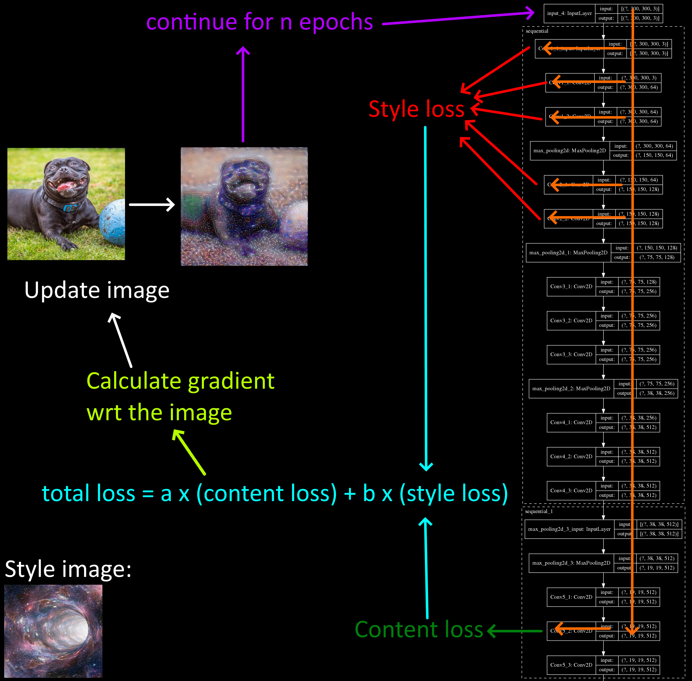
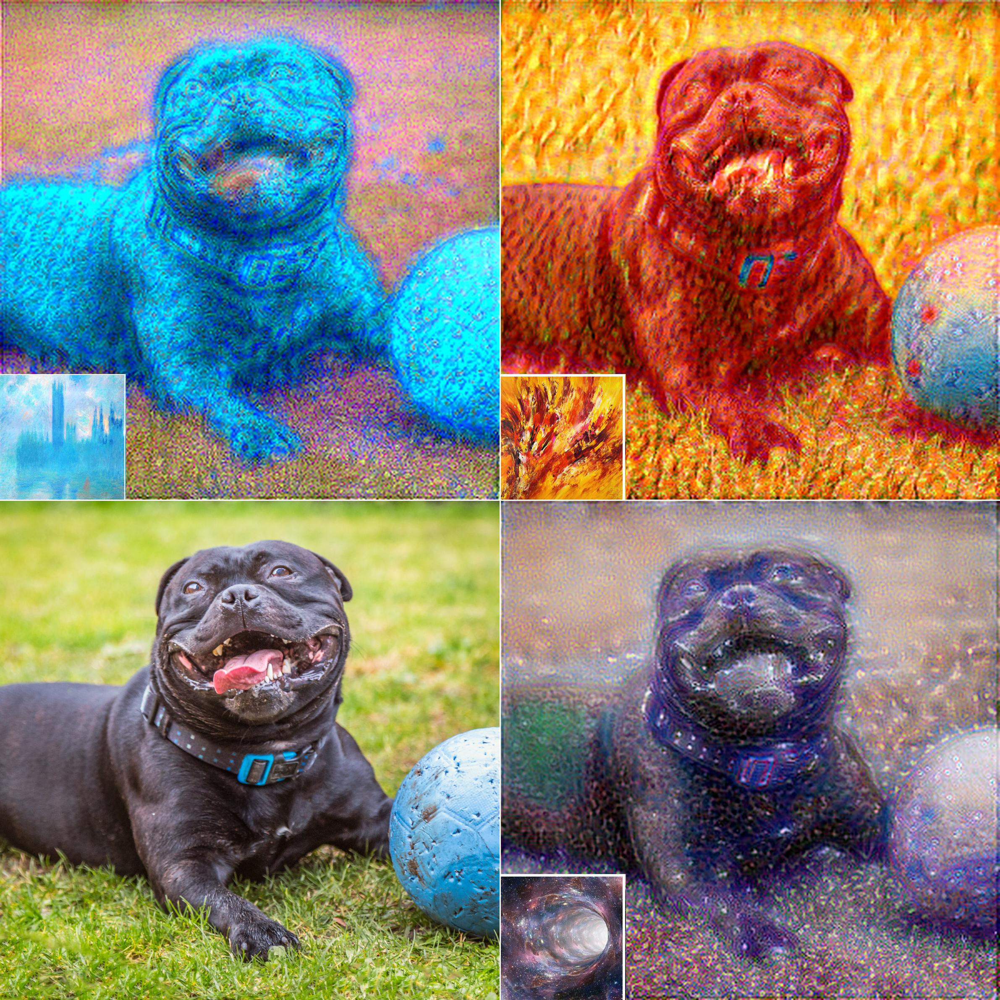

# Style transfer

## Description
 
The project is explained at the following [link](https://apiquet.com/2021/01/22/style-transfer-with-vgg-16/)

This article shows how reuse the feature extractor of a model trained for object detection in a new model designed for style transfer.

VGG-16, the feature extractor of [SSD300 model](https://arxiv.org/abs/1512.02325), from [a previous repository](https://github.com/Apiquet/Tracking_SSD_ReID) is used to achieve style transfer with the following combination of a style loss and a content loss functions:

## Usage

The notebook style_transfer_example.ipynb can be used to run the model on images and videos.

The script under utils/ allows to create concatenation of multiple inferences (image or video):

